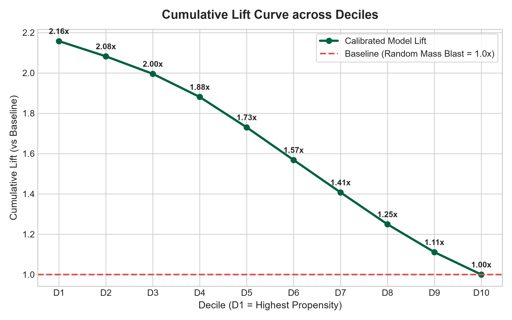
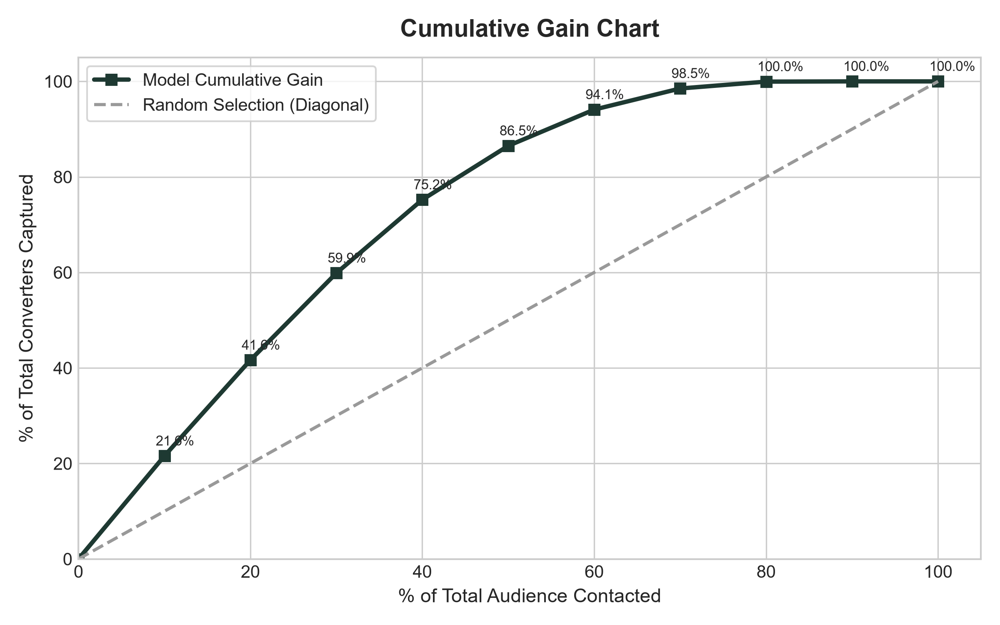
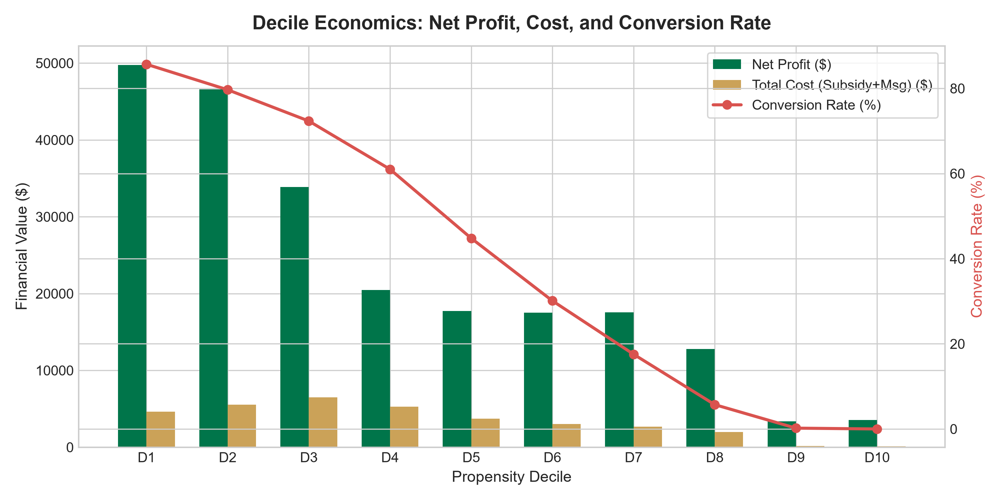

## Targeted Marketing Optimization & Uplift Strategy (Starbucks Dataset)

**Project Background** :

In the competitive food and beverage retail industry, companies frequently rely on promotional incentives (such as discounts and BOGO offers) to drive customer visits and sales. However, mass-blast promotional campaigns often lead to significant margin dilution. In this Starbucks dataset, analysis reveals that **29.6% ($48,135)** of all reward subsidies were disbursed to customers who completed purchases organically without ever opening or viewing the promotional offer (*Sure Things / Cannibalization*). Furthermore, sending unpersonalized promotions to non-responsive segments results in customer fatigue and unnecessary operational expenses. To overcome these challenges, companies need a data-driven approach to target only responsive customers (*Persuadables*) while eliminating wasteful subsidies.

**Objective** :

The objective of this project is to optimize promotional campaign effectiveness and maximize *Incremental Return on Investment* (iROI) and *Net Campaign Profit* using statistical funnel alignment and machine learning. Specifically, this project aims to:
1. Validate causal customer journey funnels to distinguish genuine influenced conversions from accidental completions.
2. Build and calibrate a predictive propensity model that accurately scores customer response likelihood.
3. Identify optimal audience deciles to maximize revenue retention while substantially cutting reward subsidy costs.

**Methodology** :

1. **Causal Funnel Alignment**: Constructed a strict temporal target variable ($y \in \{0, 1\}$) where $y = 1$ requires: `offer received` $\rightarrow$ `offer viewed` $\rightarrow$ `transaction` $\rightarrow$ `offer completed` within the valid promotion duration window. Unviewed completions are categorized as unintended/wasteful conversions ($y = 0$).
2. **Feature Engineering**: Extracted 44 interaction-level features spanning customer demographics (imputed age, income, gender, membership tenure), promotional attributes (difficulty, reward, duration, channels), and historical engagement behaviors (historical view rate, completion rate, transaction frequency, and average order value).
3. **Calibrated Machine Learning**: Trained a `HistGradientBoostingClassifier` with 3-fold cross-validated **Isotonic Calibration** evaluated via `GroupShuffleSplit` on `person_id` (80% Train, 20% Test) to ensure out-of-sample generalization across unseen customers.
4. **Decile Simulation & Unit Economics**: Segmented scored customers into 10 deciles and evaluated campaign financials under unit economic assumptions (60% F&B gross margin, delivery cost, and actual reward subsidies).

**Result** :

The calibrated machine learning model achieved strong predictive discrimination with an **ROC-AUC of 0.8799**, **PR-AUC of 0.7889**, and **Brier Score of 0.1374**. 

By evaluating customer response across deciles, the model successfully separates high-converting audiences from unresponsive segments:
* **Decile 1 (Top 10%)** achieved an **85.68% conversion rate**, representing a **2.16x lift** over the mass campaign baseline (39.71%).
* **Targeted Top 30% Strategy (D1–D3)** captured **59.9% of all converters** with an effective conversion rate of **79.23% (2.0x higher)**, while saving **$16,403.00 (50.0% reduction in reward subsidies)** and lifting campaign ROI from **664% to 782%**.
* **Targeted Top 50% Strategy (D1–D5)** captured **86.5% of all converters** with a **68.70% conversion rate**, while eliminating 7,607 unengaged communications and saving **$7,568.00 in subsidies**.
* **Bottom Deciles (D8–D10)** demonstrated negligible conversion rates (**0.00% – 5.72%**). Eliminating discount promotions for these segments prevents cannibalization and preserves business margins.

### Strategy Comparison Table

| Strategy | Targeted Audience | Audience % | Captured Converters | Converter Capture % | Effective Conv Rate | Total Revenue ($) | Reward Subsidy ($) | **Saved Subsidy ($)** | Net Profit ($) | Campaign ROI |
| :--- | :---: | :---: | :---: | :---: | :---: | :---: | :---: | :---: | :---: | :---: |
| **Mass Blast (Baseline - 100% Audience)** | 15,215 | 100.0% | 6,042 | 100.0% | 39.71% | $427,843.75 | $32,823.00 | **$0.00** | $223,122.48 | 664.0% |
| **Targeted Top 30% (High Precision D1–D3)** | **4,565** | **30.0%** | 3,617 | 59.9% | **79.23%** *(2.0x)* | $244,745.93 | $16,420.00 | **$16,403.00 (-50.0%)** | $130,199.31 | **782.0%** *(+118%)* |
| **Targeted Top 50% (Balanced Reach D1–D5)** | **7,608** | **50.0%** | 5,227 | **86.5%** | **68.70%** *(1.73x)* | $323,332.49 | $25,255.00 | **$7,568.00 (-23.1%)** | $168,364.09 | 657.0% |

---

### Campaign Performance Visualizations

#### 1. Cumulative Lift Curve

#### 2. Cumulative Gain Chart

#### 3. Decile Economics Simulation

