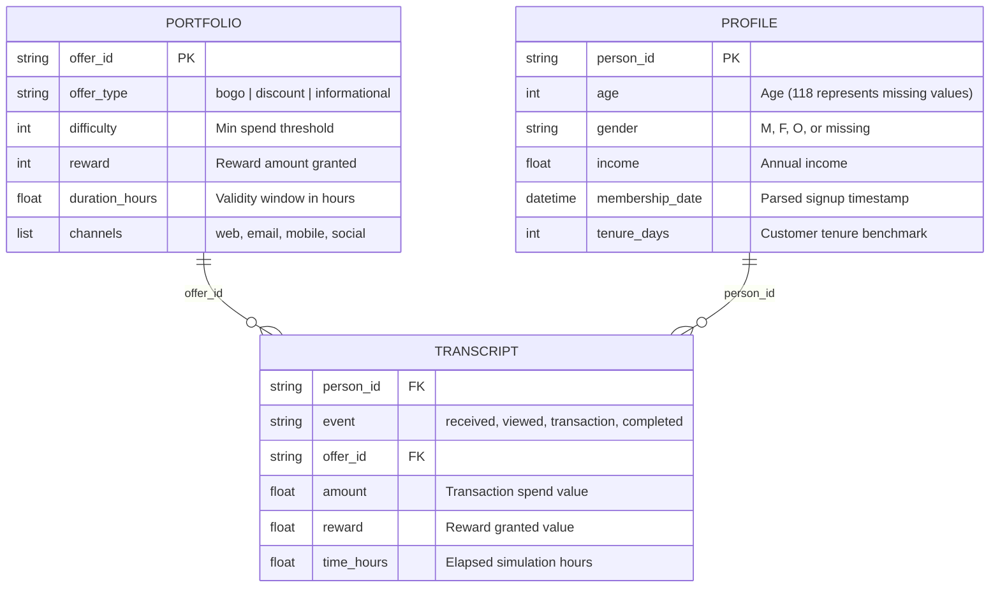

# Targeted Marketing Optimization & Uplift Strategy (Starbucks Rewards Dataset)

[](https://www.python.org/)
[](https://scikit-learn.org/)
[]()
[]()
[]()

---

## 1. Executive Summary & Business Context

In conventional consumer marketing, promotional discounts and BOGO (*Buy One Get One*) vouchers are often distributed via **mass-blast campaigns** to entire customer rosters. While top-line revenue may appear high, this approach causes substantial margin dilution:
1. **Cannibalization / "Sure Things" Deadweight Loss**: Up to **29.6% ($48,135)** of all promotional reward subsidies in this dataset were granted to customers who **never even opened or viewed the promotion**, yet completed transactions organically.
2. **Customer Fatigue & Margin Erosion**: Sending unpersonalized offers to unresponsive segments decreases long-term brand engagement and increases communication costs.
3. **Sub-optimal Allocation**: Capital is spent equally across unresponsive customers rather than concentrated on the **Persuadables** (customers whose purchase decision is genuinely altered by the incentive).

### Strategic Solution
This project implements an AI-driven **Targeted Marketing & Uplift Optimization Pipeline** that:
- **Causally aligns the event funnel** to differentiate true influenced conversions from accidental completions.
- **Trains a Calibrated Propensity Model** (HistGradientBoosting with Isotonic Regression) achieving an **ROC-AUC of 0.8799** and **PR-AUC of 0.7889**.
- **Performs Decile Scoring & Financial Simulations** allowing marketing executives to dynamically select audience cutoffs that double conversion rates, slash promotional subsidies by **50%**, and elevate campaign ROI from **664% to 782%**.

---

## 2. Executive Strategy Comparison

The table below demonstrates the test set performance comparing the traditional **Mass Blast** approach against optimized targeted tiers:

| Strategy | Targeted Audience | Audience % | Captured Converters | Converter Capture % | Effective Conv Rate | Total Revenue ($) | Reward Subsidy ($) | **Saved Subsidy ($)** | Net Profit ($) | Campaign ROI |
| :--- | :---: | :---: | :---: | :---: | :---: | :---: | :---: | :---: | :---: | :---: |
| **Mass Blast (Baseline)** | 15,215 | 100.0% | 6,042 | 100.0% | 39.71% | $427,843.75 | $32,823.00 | **$0.00** | $223,122.48 | 664.0% |
| **Targeted Top 30% (High Precision)** | **4,565** | **30.0%** | 3,617 | 59.9% | **79.23%** *(2.0x)* | $244,745.93 | $16,420.00 | **$16,403.00 (-50.0%)** | $130,199.31 | **782.0%** *(+118%)* |
| **Targeted Top 50% (Balanced Reach)** | **7,608** | **50.0%** | 5,227 | **86.5%** | **68.70%** *(1.73x)* | $323,332.49 | $25,255.00 | **$7,568.00 (-23.1%)** | $168,364.09 | 657.0% |

### Key Executive Insights:
* **The Top 30% Strategy (D1–D3)** captures **60% of all potential conversions** while cutting audience volume by **70%** and **slashing reward subsidies by 50% ($16,403 saved)**. Effective conversion rate jumps to **79.23%**.
* **The Top 50% Strategy (D1–D5)** captures **86.5% of all conversions** while eliminating 7,607 unengaged communications and saving $7,568 in reward leakage.
* **Deciles 8 to 10 (Bottom 30%)** exhibit conversion rates between **0.00% and 5.72%**. Targeting these segments produces near-zero incrementality while incurring unnecessary message and subsidy friction.

---

## 3. Dataset Architecture & Relational Schema

The dataset simulates customer interactions on the Starbucks Rewards mobile app and comprises three core relational components:



---

## 4. Causal Funnel Alignment & Target Definition ($y \in \{0, 1\}$)

A common pitfall in promotional analytics is treating every `offer completed` event as marketing success. In reality, customers frequently complete offers **by accident** without ever viewing the promotion.

To ensure causal validity, we construct the target variable $y \in \{0, 1\}$ with strict temporal validation:

```
[Offer Received (t0)] ──> [Offer Viewed (t1)] ──> [Transaction (t2)] ──> [Offer Completed (t3)]
                          └─────────────────── VALID FUNNEL (y = 1) ──────────────────────┘

[Offer Received (t0)] ──> [Transaction (t1)] ──> [Offer Completed (t2)]  (No View / Viewed After)
                          └────────── WASTEFUL CONVERSION / CANNIBALIZATION (y = 0) ───────┘
```

### Funnel Distribution Across 76,277 Offer Events:
- **Valid Conversions ($y = 1$)**: 23,344 (30.60%) — Active, influenced participants.
- **Viewed, Uncompleted ($y = 0$)**: 19,182 (25.15%) — Interested browsers who failed to meet difficulty spend.
- **Unintended / Wasteful Conversions ($y = 0$)**: 9,838 (12.90%) — **Sure Things** that completed promotions without prior awareness.
- **Expired / Ignored ($y = 0$)**: 8,678 (11.38%) — Unopened and uncompleted.
- **Informational Influenced ($y = 1$)**: 6,715 (8.80%) — Transacted within validity window following awareness.
- **Informational Ignored / No Trans ($y = 0$)**: 8,520 (11.17%) — Uninfluenced.

> **Economic Takeaway:** In total, **$48,135.00** was spent on unviewed completions, representing **29.6% of all rewards disbursed**. Eliminating this waste is the primary driver of uplift ROI.

---

## 5. Machine Learning & Uplift Architecture

### Feature Engineering (44 Interaction-Level Features):
1. **Demographic Attributes**: Imputed age, income, gender one-hot indicators (`gender_F`, `gender_M`, `gender_O`, `gender_Missing`), and membership tenure days.
2. **Offer Metadata**: Type indicators (BOGO, Discount, Informational), difficulty, reward amount, duration in days, total channel count, and specific channel delivery flags (web, email, mobile, social).
3. **Historical Behavioral Signals**:
   - Customer historical view rate: $\text{View Rate} = \frac{\text{Total Viewed}}{\text{Total Received}}$
   - Customer historical completion rate: $\text{Completion Rate} = \frac{\text{Total Completed}}{\text{Total Viewed}}$
   - Lifetime transactions count, total monetary spend, and average order value (AOV).

### Modeling & Calibration:
* **Customer Group Validation**: We split the dataset using `GroupShuffleSplit` on `person_id` (80% Train, 20% Out-of-Sample Test) to guarantee that all evaluation evaluates generalization on previously unseen customers.
* **Algorithm**: `HistGradientBoostingClassifier` with max leaf nodes = 31 and learning rate = 0.06.
* **Probability Calibration**: 3-fold cross-validated **Isotonic Regression** (`CalibratedClassifierCV`) mapping raw tree margins into empirically reliable probabilities $\hat{p} \in [0, 1]$.

### Model Validation Results:
- **ROC-AUC Score**: **0.8799**
- **PR-AUC (Average Precision)**: **0.7889**
- **Brier Score**: **0.1374**
- **Accuracy**: **80%**

---

## 6. Decile Performance & Cumulative Visualizations

Test set instances ($N = 15,215$) are partitioned into 10 deciles ranked by calibrated propensity:

| Decile | Audience Count | Converters | Conversion Rate | Decile Lift | Cumulative Lift | Total Spend ($) | Reward Cost ($) | Net Profit ($) | Decile ROI |
| :---: | :---: | :---: | :---: | :---: | :---: | :---: | :---: | :---: | :---: |
| **D1** | 1,522 | 1,304 | **85.68%** | **2.16x** | **2.16x** | $90,631.28 | $4,561.00 | $49,741.67 | 10.7x |
| **D2** | 1,521 | 1,212 | **79.68%** | **2.01x** | **2.08x** | $86,854.68 | $5,450.00 | $46,586.76 | 8.4x |
| **D3** | 1,522 | 1,101 | **72.34%** | **1.82x** | **2.00x** | $67,259.97 | $6,409.00 | $33,870.88 | 5.2x |
| **D4** | 1,521 | 928 | **61.01%** | **1.54x** | **1.88x** | $42,860.32 | $5,193.00 | $20,447.14 | 3.9x |
| **D5** | 1,522 | 682 | **44.81%** | **1.13x** | **1.73x** | $35,726.24 | $3,642.00 | $17,717.64 | 4.8x |
| **D6** | 1,521 | 458 | **30.11%** | **0.76x** | **1.57x** | $34,246.82 | $2,939.00 | $17,533.04 | 5.8x |
| **D7** | 1,521 | 267 | **17.55%** | **0.44x** | **1.41x** | $33,679.34 | $2,579.00 | $17,552.55 | 6.6x |
| **D8** | 1,522 | 87 | **5.72%** | **0.14x** | **1.25x** | $24,657.97 | $1,921.00 | $12,797.68 | 6.4x |
| **D9** | 1,521 | 3 | **0.20%** | **0.005x** | **1.11x** | $5,828.69 | $72.00 | $3,349.16 | 22.6x |
| **D10** | 1,522 | 0 | **0.00%** | **0.00x** | **1.00x** | $6,098.44 | $57.00 | $3,525.96 | 26.5x |

### Visualizations:

#### 1. Cumulative Lift Curve

*Shows model effectiveness relative to random mass blasts. Decile 1 achieves 2.16x baseline response.*

#### 2. Cumulative Gain Chart

*Illustrates concentration of converters. Contacting the top 30% captures 60% of all converters; contacting 50% captures 86.5%.*

#### 3. Decile Economics Simulation

*Visualizes Net Profit, Cost, and Conversion Rates per decile, demonstrating steep drop-offs after D5.*

---

## 7. Repository Structure

```
Targeted-Marketing-Optimization-Uplift-Strategy/
├── artifacts/                           # Simulation reports and high-resolution charts
│   ├── decile_profit_simulation.png
│   ├── decile_summary.csv
│   ├── executive_comparison.csv
│   ├── gain_chart.png
│   └── lift_curve.png
├── data/
│   ├── raw/                             # Downloaded raw Starbucks JSON datasets
│   │   ├── portfolio.json
│   │   ├── profile.json
│   │   └── transcript.json
│   └── processed/                       # Engineered feature matrix
│       └── customer_offer_features.csv
├── notebooks/
│   └── 01_eda_and_uplift_modeling.ipynb # Interactive end-to-end analysis notebook
├── src/                                 # Modular production Python package
│   ├── __init__.py
│   ├── data_loader.py                   # Anomaly cleaning & JSON parsing
│   ├── funnel_builder.py                # Causal funnel alignment engine
│   ├── feature_engineering.py           # Feature aggregator & behavioral metrics
│   ├── model.py                         # Gradient boosting & probability calibration
│   └── financial_sim.py                 # Unit economics & decile simulations
├── download_data.py                     # Automated raw data fetcher
├── main_pipeline.py                     # Master execution script
├── requirements.txt                     # Pinned dependencies
├── .gitignore
└── README.md
```

---

## 8. Quick Start Guide

### Prerequisites
- Python 3.10+
- Virtual environment tool (`venv` or `conda`)

### 1. Clone the Repository
```bash
git clone https://github.com/Makrufkasr/Targeted-Marketing-Optimization-Uplift-Strategy.git
cd Targeted-Marketing-Optimization-Uplift-Strategy
```

### 2. Install Dependencies
```bash
pip install -r requirements.txt
```

### 3. Download Raw Datasets
```bash
python download_data.py
```

### 4. Run the Full End-to-End Pipeline
```bash
python main_pipeline.py
```

### 5. Launch Interactive Jupyter Notebook
```bash
jupyter lab notebooks/01_eda_and_uplift_modeling.ipynb
```

---

## 9. Business Impact & Strategic Recommendations

1. **Stop Subsidizing Sure Things**: Immediately implement causal awareness checks before automatically granting rewards on app promotions. This single policy change protects up to **29.6%** of promo subsidies from cannibalization.
2. **Adopt Top 30%–50% Cutoff Policy**:
   - For high-margin/limited-inventory products, restrict campaigns to **D1–D3** (yielding a **79.2% conversion rate** and saving 50% on reward costs).
   - For broad engagement or new product introductions, expand to **D1–D5** (capturing **86.5%** of converters while cutting 50% of broadcast volume).
3. **Suppress Deciles 8 through 10**: Permanently filter out the bottom 30% from discount pushes to prevent promotion wear-out and redirect resources toward brand-building informational touchpoints.

---

## 10. License & Author
* **Author**: Makruf Kasr
* **Repository**: [Targeted-Marketing-Optimization-Uplift-Strategy](https://github.com/Makrufkasr/Targeted-Marketing-Optimization-Uplift-Strategy)
* **Dataset**: Starbucks Rewards Customer Engagement (Udacity / Kaggle)
